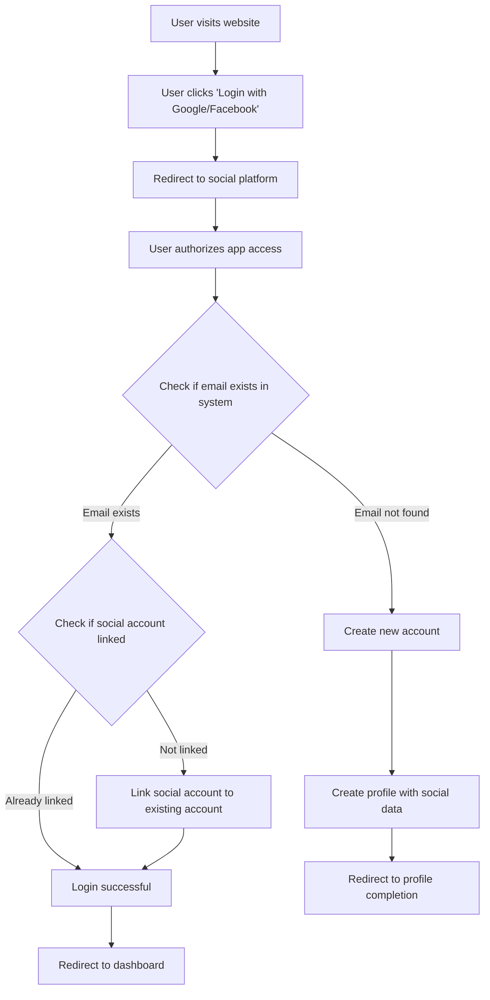

### User Story 2: Social Media Authentication

**As a** prospective student  
**I want to** register/login using my Google or Facebook account  
**So that** I can quickly access the platform without remembering another password

**Acceptance Criteria:**

1. User can see Google and Facebook login buttons on the registration/login page
2. User can click on either button to initiate OAuth authentication flow
3. System requests appropriate permissions from the social platform
4. System creates a new account if the user is logging in for the first time
5. System links the social account to an existing account if the email matches
6. User is redirected to the dashboard or profile completion page as appropriate

**Story Points:** 8  
**Priority:** Medium  
**Dependencies:** None

---

**Diagram**

