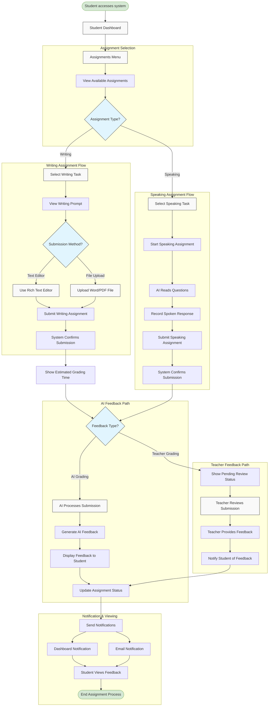

# Epic 10: Homework Submission

## Epic Description

**As a** student  
**I want to** submit Writing and Speaking assignments  
**So that** I can receive feedback and improve my skills

## Epic Overview

This epic covers the assignment submission process for students, focusing specifically on Writing and Speaking tasks. The system will provide intuitive interfaces for students to submit different types of assignments, track their submission status, and receive timely feedback from both AI and human teachers. For Writing assignments, students can compose directly in a rich text editor or upload documents. For Speaking assignments, students can record their responses to prompts. The system will provide immediate AI-generated feedback where possible, while also supporting teacher review for more comprehensive assessment. This epic ensures students can easily manage their assignments and receive the guidance they need to improve their language skills.

**Epic Points:** 21  
**Priority:** High  
**Dependencies:** Epic 8 - Lesson Experience, Epic 9 - Lesson Interactions

## User Stories

This epic contains the following user stories:

1. [US10.1: Assignment Dashboard](./us10.1-assignment-dashboard.md)
2. [US10.2: Writing Assignment Submission](./us10.2-writing-assignment-submission.md)
3. [US10.3: Speaking Assignment Submission](./us10.3-speaking-assignment-submission.md)
4. [US10.4: AI-Generated Feedback](./us10.4-ai-generated-feedback.md)
5. [US10.5: Teacher Review Process](./us10.5-teacher-review-process.md)
6. [US10.6: Feedback Notification System](./us10.6-feedback-notification-system.md)
7. [US10.7: Assignment History & Progress](./us10.7-assignment-history-progress.md)

---

## Epic Flow Diagram

## Technical Considerations

- Implement secure file upload system for document submissions
- Create a robust rich text editor with autosave functionality
- Develop high-quality audio recording and processing capabilities
- Implement AI grading algorithms for both writing and speaking assignments
- Design a teacher review interface that streamlines the grading process
- Create a notification system that works across multiple channels
- Implement a secure database for storing assignments and feedback
- Ensure all submission interfaces are accessible and work on mobile devices
- Design clear status indicators for assignment progress
- Implement analytics to track submission patterns and feedback effectiveness
- Create a system for managing assignment deadlines and late submissions
- Ensure privacy and data protection for all student submissions
- Design a scalable architecture to handle peak submission periods
- Implement offline capabilities for assignment composition
