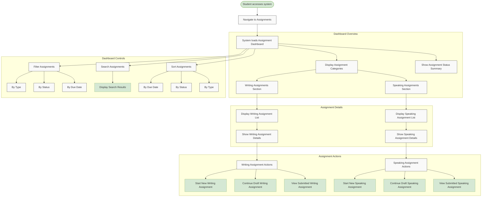

# US10.1: Assignment Dashboard

## User Story

**As a** student  
**I want to** access a centralized assignment dashboard  
**So that** I can view, manage, and track all my assignments in one place

## Acceptance Criteria

1. Dashboard displays all available and completed assignments
2. Assignments are categorized by type (Writing, Speaking)
3. Each assignment shows:
   - Title and brief description
   - Due date and time remaining
   - Status (Not Started, In Progress, Submitted, Graded)
   - Assignment type icon (Writing, Speaking)
4. Dashboard includes filtering options (All, Writing, Speaking, Completed, Pending)
5. Assignments are sorted by due date by default (closest first)
6. Dashboard shows a progress summary (completed vs. total assignments)
7. System highlights assignments with approaching deadlines
8. Dashboard is responsive and works on all devices
9. Dashboard includes a search function to find specific assignments
10. Dashboard provides direct links to start or continue assignments

## Flow Diagram

## Details

**Story Points:** 3  
**Priority:** High  
**Epic:** [Epic 10: Homework Submission](./README.md)

## Implementation Notes

- Design an intuitive dashboard layout with clear visual hierarchy
- Implement responsive design for all device sizes
- Create efficient database queries to retrieve assignment data
- Implement real-time status updates for assignments
- Design clear visual indicators for assignment status
- Create a filtering system that updates dynamically
- Implement search functionality with relevant result ranking
- Design accessible navigation between dashboard and assignment pages
- Implement analytics to track dashboard usage patterns
- Ensure dashboard loads quickly even with many assignments
- Create a caching mechanism for improved performance
