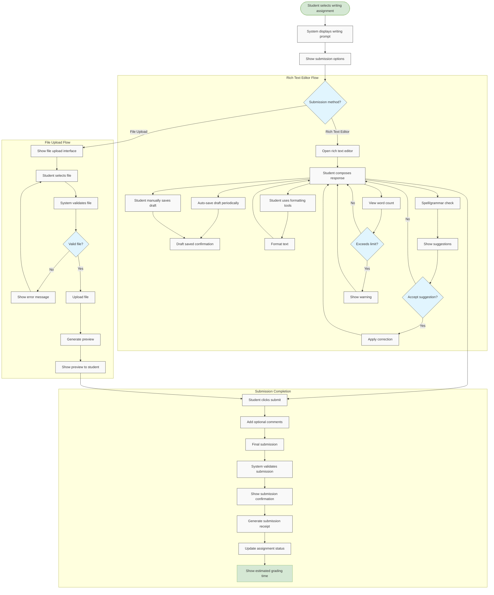

# US10.2: Writing Assignment Submission

## User Story

**As a** student  
**I want to** submit writing assignments through multiple methods  
**So that** I can demonstrate my writing skills and receive feedback

## Acceptance Criteria

1. System provides a clear writing prompt with instructions
2. Students can submit writing assignments through:
   - Built-in rich text editor with formatting options
   - File upload (supporting Word, PDF, and text formats)
3. Rich text editor includes:
   - Basic formatting (bold, italic, underline)
   - Paragraph styles and alignment
   - Spell check and grammar suggestions
   - Word count and character count
4. System automatically saves drafts every 30 seconds
5. Students can manually save drafts and continue later
6. File upload includes validation for file type and size
7. System provides a preview of uploaded documents
8. Students can add comments or notes with their submission
9. System confirms successful submission with a receipt
10. Students can view their submission after it's submitted
11. System enforces word count limits where applicable
12. Students can resubmit until the deadline if allowed

## Flow Diagram

## Details

**Story Points:** 5  
**Priority:** High  
**Epic:** [Epic 10: Homework Submission](./README.md)

## Implementation Notes

- Implement a robust rich text editor with autosave functionality
- Create secure file upload system with virus scanning
- Implement document preview generation for uploaded files
- Design clear writing prompts with formatting
- Create a draft saving system that works across sessions
- Implement word count and character count functionality
- Design a submission confirmation system with receipts
- Create a system for managing submission versions
- Implement validation for file types and sizes
- Ensure all text editor features work across devices
- Design mobile-friendly writing interfaces
- Implement analytics to track submission methods and patterns
