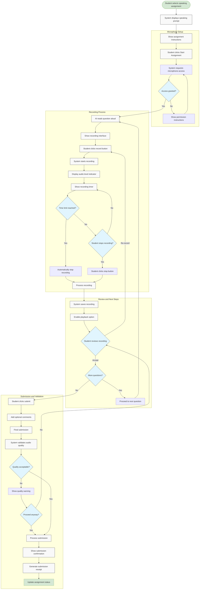

# US10.3: Speaking Assignment Submission

## User Story

**As a** student  
**I want to** complete and submit speaking assignments  
**So that** I can practice and improve my speaking skills

## Acceptance Criteria

1. System provides clear speaking prompts and instructions
2. AI can read questions aloud with natural pronunciation
3. Students can record their spoken responses directly in the browser
4. Recording interface includes:
   - Start/stop recording controls
   - Audio level indicator
   - Timer showing recording duration
   - Playback option to review recording
   - Re-record option
5. System checks for adequate audio quality before submission
6. Students can pause and resume during longer speaking tasks
7. System supports multiple question formats (short answer, long response, etc.)
8. Students can add notes or comments with their submission
9. System confirms successful submission with a receipt
10. Students can listen to their submission after it's submitted
11. System enforces time limits for responses where applicable
12. Interface works on mobile devices with proper microphone access

## Flow Diagram

## Details

**Story Points:** 5  
**Priority:** High  
**Epic:** [Epic 10: Homework Submission](./README.md)

## Implementation Notes

- Implement browser-based audio recording with fallback options
- Create a system for audio quality assessment
- Implement text-to-speech for question reading
- Design intuitive recording controls with clear visual feedback
- Create secure audio storage and processing system
- Implement audio compression for efficient storage and playback
- Design mobile-friendly recording interface
- Create proper permission handling for microphone access
- Implement analytics to track recording quality and completion rates
- Ensure accessibility for users with different abilities
- Design clear visual indicators for recording status
- Test recording functionality across different devices and browsers
