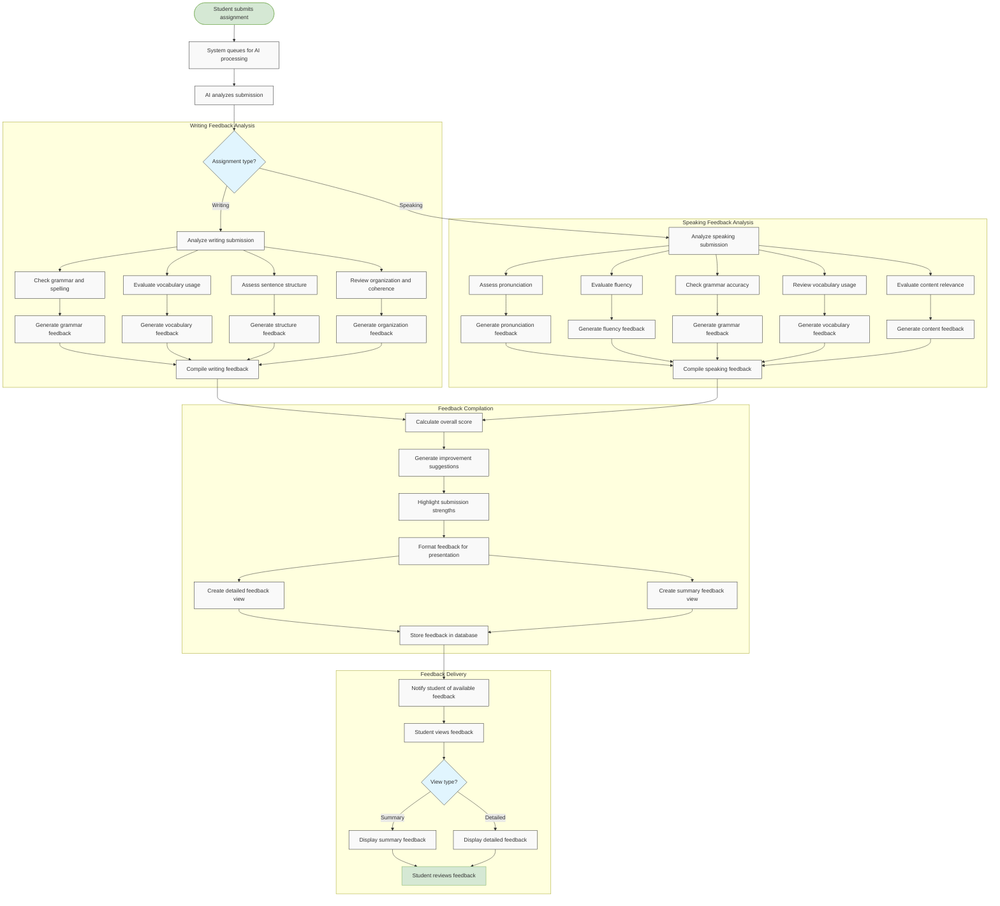

# US10.4: AI-Generated Feedback

## User Story

**As a** student  
**I want to** receive immediate AI-generated feedback on my assignments  
**So that** I can quickly identify areas for improvement

## Acceptance Criteria

1. System provides AI-generated feedback within minutes of submission
2. For writing assignments, AI feedback includes:
   - Grammar and spelling corrections
   - Vocabulary suggestions
   - Sentence structure improvements
   - Organization and coherence assessment
   - Overall score with rubric breakdown
3. For speaking assignments, AI feedback includes:
   - Pronunciation assessment
   - Fluency evaluation
   - Grammar accuracy
   - Vocabulary usage
   - Content relevance to prompt
   - Overall score with rubric breakdown
4. Feedback highlights specific examples from the submission
5. AI provides constructive suggestions for improvement
6. Feedback is presented in a clear, easy-to-understand format
7. Students can see both detailed and summary feedback views
8. System indicates which aspects were evaluated by AI
9. Feedback includes positive reinforcement for strengths
10. AI feedback is available for review at any time after submission

## Flow Diagram

## Details

**Story Points:** 5  
**Priority:** High  
**Epic:** [Epic 10: Homework Submission](./README.md)

## Implementation Notes

- Implement NLP models for writing assessment
- Develop speech recognition and analysis for speaking assessment
- Create clear feedback visualization with highlighting
- Design a scoring system based on educational rubrics
- Implement a feedback generation system that provides constructive criticism
- Create a system for identifying and highlighting submission strengths
- Design different feedback views (detailed vs. summary)
- Implement secure processing of student submissions
- Ensure feedback generation is fast and reliable
- Create fallback mechanisms for AI processing failures
- Design mobile-friendly feedback displays
- Implement analytics to track feedback effectiveness
