# US10.5: Teacher Review Process

## User Story

**As a** student  
**I want to** receive teacher feedback on my assignments  
**So that** I can benefit from expert guidance and personalized assessment

## Acceptance Criteria

1. System shows "Pending Review" status for assignments awaiting teacher feedback
2. Students can see estimated time for teacher review completion
3. Teachers can access a queue of assignments requiring review
4. Teachers can view AI-generated feedback before adding their own assessment
5. Teacher feedback includes:
   - Personalized comments on specific parts of the submission
   - Detailed explanations of errors and improvement areas
   - Custom scoring based on educational rubrics
   - Encouragement and positive reinforcement
6. Teachers can provide audio feedback for speaking assignments
7. Teachers can annotate writing submissions directly
8. System notifies students when teacher feedback is available
9. Students can view teacher feedback alongside AI feedback
10. Students can ask follow-up questions about teacher feedback
11. System tracks teacher review time for quality assurance
12. Students can see which aspects were evaluated by teachers vs. AI

## Flow Diagram

```mermaid
flowchart TD
    %% Student and Teacher entry points
    StudentStart([Student submits assignment]) --> PendingReview[System marks as Pending Review]
    PendingReview --> EstimatedTime[Show estimated review time to student]

    TeacherStart([Teacher logs into system]) --> ReviewQueue[Teacher accesses review queue]

    subgraph "Teacher Review Process"
        ReviewQueue --> SelectAssignment[Teacher selects assignment to review]
        SelectAssignment --> LoadDetails[System loads submission details]

        LoadDetails --> ShowAIFeedback[Display AI-generated feedback]
        LoadDetails --> ShowSubmission[Show student submission content]

        ShowSubmission --> AssignmentTypeCheck{Assignment type?}

        %% Writing review path
        AssignmentTypeCheck -- Writing --> DisplayWriting[Display writing submission]
        DisplayWriting --> ReviewWriting[Teacher reviews written content]
        ReviewWriting --> AnnotateWriting[Teacher annotates specific sections]
        AnnotateWriting --> AddWritingComments[Teacher adds detailed comments]
        AddWritingComments --> CompleteAssessment[Teacher completes assessment]

        %% Speaking review path
        AssignmentTypeCheck -- Speaking --> PlayAudio[Play audio submission]
        PlayAudio --> AssessPronunciation[Teacher assesses pronunciation]
        AssessPronunciation --> EvaluateFluency[Teacher evaluates fluency]
        EvaluateFluency --> RecordFeedback[Teacher records audio feedback]
        RecordFeedback --> CompleteAssessment

        CompleteAssessment --> ScoreRubric[Teacher scores based on rubric]
        ScoreRubric --> AddOverallFeedback[Teacher adds overall feedback]
        AddOverallFeedback --> SubmitReview[Teacher submits review]
    end

    subgraph "Feedback Processing"
        SubmitReview --> ProcessFeedback[System processes teacher feedback]
        ProcessFeedback --> CompareFeedback[System compares with AI feedback]
        CompareFeedback --> CombineFeedback[System combines feedback sources]

        CombineFeedback --> UpdateStatus[Update assignment status to Graded]
        UpdateStatus --> NotifyStudent[Notify student of available feedback]
    end

    subgraph "Student Feedback Interaction"
        NotifyStudent --> ViewFeedback[Student views feedback]
        ViewFeedback --> DisplayFeedback[Display combined feedback]
        DisplayFeedback --> HighlightSources[Highlight teacher vs AI feedback]

        HighlightSources --> QuestionCheck{Student has questions?}

        QuestionCheck -- Yes --> SubmitQuestion[Student submits follow-up question]
        SubmitQuestion --> NotifyTeacher[Notify teacher of question]
        NotifyTeacher --> TeacherResponds[Teacher responds to question]
        TeacherResponds --> StudentReceives[Student receives response]
        StudentReceives --> ApplyFeedback[Student applies feedback]

        QuestionCheck -- No --> ApplyFeedback
    end

    %% Style
    classDef process fill:#f9f9f9,stroke:#333,stroke-width:1px;
    classDef decision fill:#e1f5fe,stroke:#333,stroke-width:1px;
    classDef endpoint fill:#d5e8d4,stroke:#82b366,stroke-width:1px;

    class StudentStart,TeacherStart,ApplyFeedback endpoint;
    class AssignmentTypeCheck,QuestionCheck decision;
    class PendingReview,EstimatedTime,ReviewQueue,SelectAssignment,LoadDetails,ShowAIFeedback,ShowSubmission,DisplayWriting,ReviewWriting,AnnotateWriting,AddWritingComments,PlayAudio,AssessPronunciation,EvaluateFluency,RecordFeedback,CompleteAssessment,ScoreRubric,AddOverallFeedback,SubmitReview,ProcessFeedback,CompareFeedback,CombineFeedback,UpdateStatus,NotifyStudent,ViewFeedback,DisplayFeedback,HighlightSources,SubmitQuestion,NotifyTeacher,TeacherResponds,StudentReceives process;
```

## Details

**Story Points:** 3  
**Priority:** High  
**Epic:** [Epic 10: Homework Submission](./README.md)

## Implementation Notes

- Design a teacher review queue with prioritization
- Create an annotation system for writing submissions
- Implement audio recording for teacher speaking feedback
- Design a clear interface distinguishing AI vs. teacher feedback
- Create a follow-up question system for student-teacher interaction
- Implement a notification system for feedback availability
- Design rubric-based scoring tools for teachers
- Create analytics for tracking review times and quality
- Implement a system for combining AI and teacher feedback
- Design mobile-friendly review interfaces for teachers
- Ensure all feedback is securely stored and accessible
- Create a system for managing review workload among teachers
