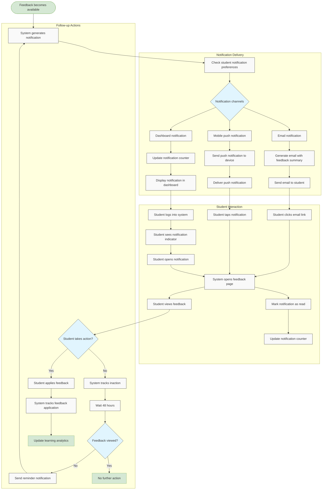

# US10.6: Feedback Notification System

## User Story

**As a** student  
**I want to** be notified when feedback is available for my assignments  
**So that** I can review it promptly and apply the suggestions

## Acceptance Criteria

1. System notifies students when feedback is available through multiple channels:
   - Dashboard notifications
   - Email notifications
   - Mobile push notifications (if app is installed)
2. Notifications include:
   - Assignment name
   - Feedback type (AI, teacher, or both)
   - Time when feedback became available
   - Direct link to view feedback
3. Dashboard shows a notification counter for unread feedback
4. Students can mark notifications as read
5. Students can customize notification preferences
6. Email notifications include a summary of the feedback
7. System sends reminders if feedback remains unviewed after 48 hours
8. Notifications are grouped by assignment to prevent overwhelming students
9. Students can see all past notifications in a notification history
10. System tracks notification delivery and open rates

## Flow Diagram

## Details

**Story Points:** 2  
**Priority:** Medium  
**Epic:** [Epic 10: Homework Submission](./README.md)

## Implementation Notes

- Design a multi-channel notification system
- Implement dashboard notification counter
- Create email templates for feedback notifications
- Develop mobile push notification integration
- Design notification preference settings
- Implement notification tracking and analytics
- Create a notification history view
- Design a reminder system for unviewed feedback
- Implement notification grouping to prevent overwhelming students
- Ensure all notifications include direct links to relevant content
- Design mobile-friendly notification interfaces
- Test notification delivery across different devices and email clients
