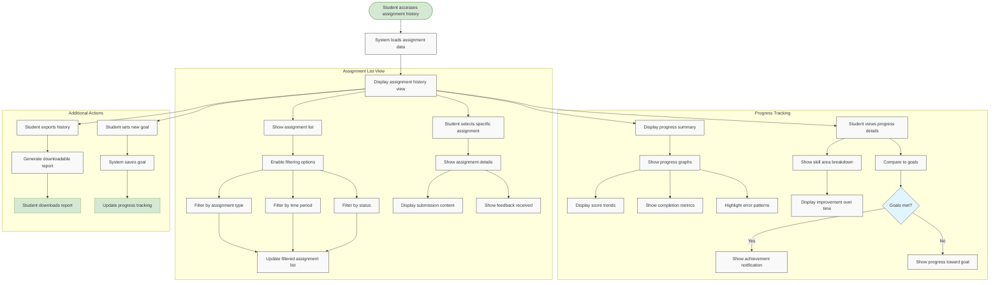

# US10.7: Assignment History & Progress

## User Story

**As a** student  
**I want to** track my assignment history and progress over time  
**So that** I can see my improvement and identify areas needing more work

## Acceptance Criteria

1. System provides a comprehensive assignment history view
2. History includes all submitted assignments with:
   - Submission date and time
   - Assignment type and title
   - Score/grade received
   - Feedback status
   - Time taken to complete
3. Students can filter history by:
   - Assignment type (Writing, Speaking)
   - Time period (Last week, Last month, Custom range)
   - Status (Graded, Pending, In Progress)
4. System shows progress trends over time with visual graphs
5. Progress tracking includes:
   - Score improvements by skill area
   - Completion rate and timeliness
   - Common error patterns and improvements
   - Comparison to personal goals
6. Students can download their assignment history and progress reports
7. System highlights personal bests and achievements
8. Students can set improvement goals and track progress toward them
9. History view is responsive and works on all devices
10. Students can access previous submissions and feedback from history view

## Flow Diagram

## Details

**Story Points:** 3  
**Priority:** Medium  
**Epic:** [Epic 10: Homework Submission](./README.md)

## Implementation Notes

- Design an intuitive history view with clear organization
- Implement data visualization for progress tracking
- Create efficient database queries for assignment history
- Design filtering system with real-time updates
- Implement export functionality for reports
- Create a goal-setting and tracking system
- Design achievement recognition features
- Implement analytics to identify improvement patterns
- Create mobile-friendly data visualizations
- Design accessible progress tracking interfaces
- Ensure performance optimization for students with large assignment histories
- Implement secure access to historical submissions and feedback
