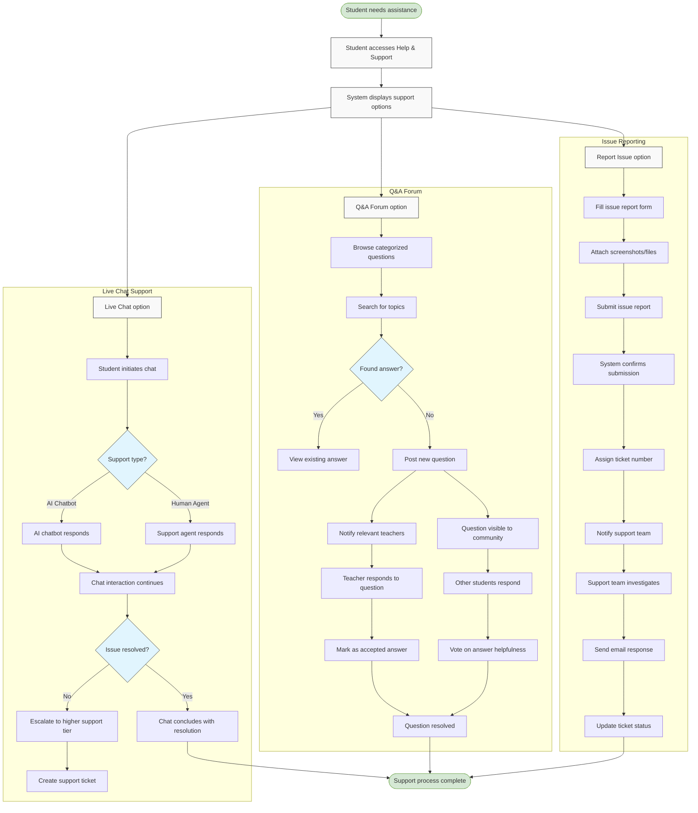

# Epic 11: Requesting Support & Q&A Forum

## Epic Description

**As a** student  
**I want to** request support and interact in the Q&A forum  
**So that** I can clarify doubts and get assistance when needed

## Epic Overview

This epic covers the support and community engagement aspects of the platform, providing students with multiple channels to seek help and interact with peers and teachers. The system offers three main support pathways: Live Chat for immediate technical assistance, Q&A Forum for academic questions and community learning, and Issue Reporting for formal problem documentation. These features ensure that students can quickly resolve technical issues, engage in collaborative learning, and report complex problems that require deeper investigation. By providing comprehensive support options, the platform enhances the overall learning experience and helps students overcome obstacles efficiently.

**Epic Points:** 18  
**Priority:** High  
**Dependencies:** Epic 1 - Authentication

## User Stories

This epic contains the following user stories:

1. [US11.1: Help & Support Navigation](./us11.1-help-support-navigation.md)
2. [US11.2: Live Chat Support](./us11.2-live-chat-support.md)
3. [US11.3: Q&A Forum](./us11.3-qa-forum.md)
4. [US11.4: Issue Reporting System](./us11.4-issue-reporting-system.md)
5. [US11.5: Support Ticket Management](./us11.5-support-ticket-management.md)
6. [US11.6: Community Engagement](./us11.6-community-engagement.md)

---

## Epic Flow Diagram

## Technical Considerations

- Implement a real-time chat system with both AI and human support capabilities
- Create a robust Q&A forum with search, categorization, and voting features
- Develop a ticket management system for tracking and resolving reported issues
- Implement notification systems for new questions, answers, and ticket updates
- Design mobile-responsive interfaces for all support channels
- Create a knowledge base integration for common questions and issues
- Implement user permission levels for different support functions
- Design analytics to track support metrics and identify common issues
- Create escalation paths for unresolved issues
- Implement moderation tools for Q&A forum content
- Design accessibility features for all support interfaces
- Create secure file upload for screenshots and attachments
- Implement email integration for ticket notifications and updates
- Design a system for categorizing and tagging support content
