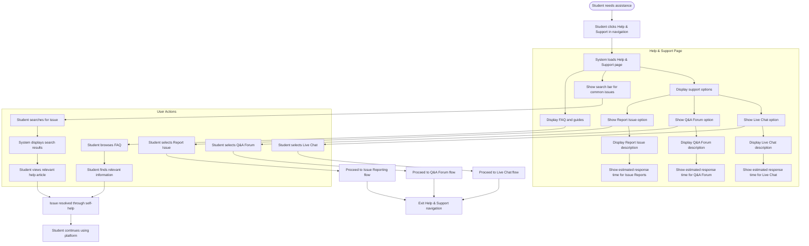

# US11.1: Help & Support Navigation

## User Story

**As a** student  
**I want to** easily access help and support options  
**So that** I can quickly find assistance when I encounter problems

## Acceptance Criteria

1. Help & Support option is prominently displayed in the main navigation menu
2. Clicking Help & Support displays a page with three clear options:
   - Live Chat with Support
   - Q&A Forum
   - Report an Issue
3. Each support option includes a brief description of its purpose
4. System displays estimated response times for each support channel
5. Help & Support page includes a search bar for quick access to common issues
6. Page displays links to frequently asked questions and troubleshooting guides
7. Support options are accessible from any page in the application
8. Help & Support interface is responsive and works on all devices
9. Page includes contact information for emergency support situations
10. System tracks which support options are most frequently used

## Flow Diagram

## Details

**Story Points:** 2  
**Priority:** High  
**Epic:** [Epic 11: Requesting Support & Q&A Forum](./README.md)

## Implementation Notes

- Design an intuitive Help & Support interface with clear visual hierarchy
- Implement responsive design for all device sizes
- Create a search system that indexes help articles and FAQs
- Design clear icons and descriptions for each support option
- Implement analytics to track support option usage
- Ensure Help & Support is accessible from all application pages
- Create a system for displaying accurate response time estimates
- Design accessibility features for all support navigation elements
- Implement a knowledge base integration for self-help options
- Create a feedback mechanism for help article usefulness
- Test navigation usability with actual students
