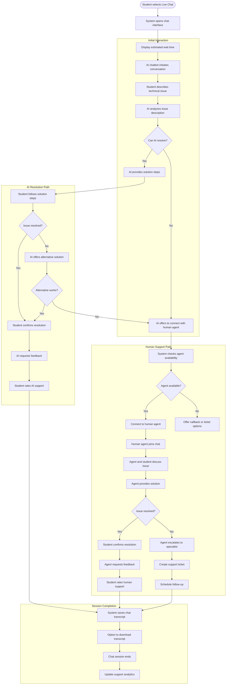

# US11.2: Live Chat Support

## User Story

**As a** student  
**I want to** use live chat for immediate technical support  
**So that** I can quickly resolve issues that prevent me from learning

## Acceptance Criteria

1. Live Chat option is clearly visible on the Help & Support page
2. Clicking Live Chat opens a chat interface without leaving the current page
3. System displays estimated wait time for connecting with support
4. Initial interaction is with an AI chatbot for common technical issues
5. AI chatbot can:
   - Answer frequently asked technical questions
   - Provide step-by-step troubleshooting guidance
   - Escalate to human support when needed
6. Human support agents are available during specified hours
7. Chat interface includes:
   - Text input field
   - Message history
   - Typing indicators
   - Option to attach screenshots
   - Option to rate support quality after session
8. Students can download chat transcript for future reference
9. System maintains chat history for returning to previous conversations
10. Chat interface is responsive and works on all devices

## Flow Diagram

## Details

**Story Points:** 5  
**Priority:** High  
**Epic:** [Epic 11: Requesting Support & Q&A Forum](./README.md)

## Implementation Notes

- Implement a real-time chat system with WebSocket technology
- Create an AI chatbot with natural language processing capabilities
- Design a knowledge base for common technical issues and solutions
- Implement a queuing system for human support agents
- Create a secure file upload system for screenshots
- Design a responsive chat interface that works across devices
- Implement chat history storage and retrieval
- Create a feedback and rating system for support quality
- Design a system for chat transcript generation and download
- Implement analytics to track common issues and resolution rates
- Create an escalation path from AI to human support
- Design a system for managing support agent availability
- Implement typing indicators and read receipts
- Test chat functionality across different devices and browsers
