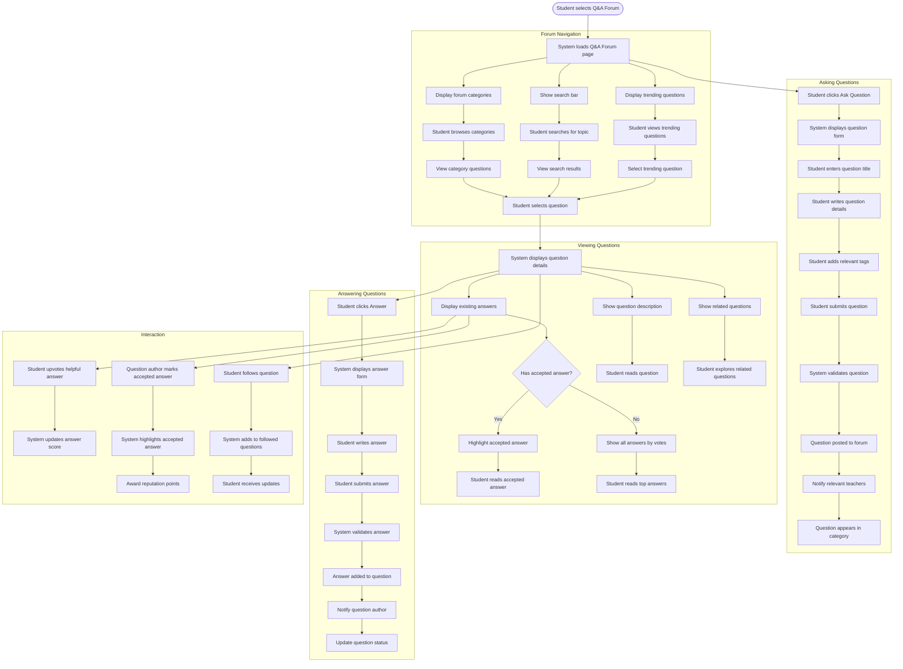

# US11.3: Q&A Forum

## User Story

**As a** student  
**I want to** participate in a Q&A forum for academic questions  
**So that** I can learn from teachers and peers in a collaborative environment

## Acceptance Criteria

1. Q&A Forum option is clearly visible on the Help & Support page
2. Forum is organized into categories based on course topics and levels
3. Students can:
   - Browse existing questions by category
   - Search for specific topics
   - Post new questions
   - Answer other students' questions
   - Upvote helpful answers
   - Mark answers as accepted solution
   - Follow questions for updates
4. Teachers receive notifications for new questions in their subject areas
5. System highlights teacher responses to distinguish them from peer answers
6. Questions display:
   - Title and detailed description
   - Tags for relevant topics
   - Date posted
   - View count
   - Number of answers
   - Status (answered/unanswered)
7. Forum includes a reputation system to encourage quality contributions
8. Students can edit or delete their own questions and answers
9. System provides moderation tools for inappropriate content
10. Forum interface is responsive and works on all devices

## Flow Diagram

## Details

**Story Points:** 5  
**Priority:** High  
**Epic:** [Epic 11: Requesting Support & Q&A Forum](./README.md)

## Implementation Notes

- Implement a robust forum system with categories and tagging
- Create a search engine with relevant result ranking
- Design a reputation and voting system to encourage quality contributions
- Implement notification systems for question updates and answers
- Create moderation tools for inappropriate content
- Design a responsive forum interface that works across devices
- Implement a system for marking and highlighting accepted answers
- Create a following system for question updates
- Design analytics to track popular topics and question resolution rates
- Implement SEO optimization for question indexing
- Create a system for suggesting related questions
- Design accessibility features for all forum elements
- Implement rich text editing for questions and answers
- Create a system for teacher notifications based on subject expertise
