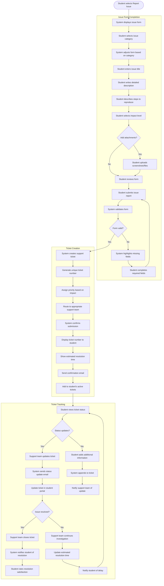

# US11.4: Issue Reporting System

## User Story

**As a** student  
**I want to** report complex issues that require investigation  
**So that** they can be properly documented and resolved by the support team

## Acceptance Criteria

1. Report an Issue option is clearly visible on the Help & Support page
2. System provides a structured form for issue reporting with fields for:
   - Issue category selection
   - Issue title
   - Detailed description
   - Steps to reproduce
   - Impact level (low, medium, high, critical)
   - File/screenshot attachments
3. Form includes guidance on providing effective issue descriptions
4. System validates form completion before submission
5. Upon submission, system:
   - Confirms receipt with a success message
   - Generates a unique ticket number
   - Provides estimated resolution timeframe
   - Sends confirmation email with ticket details
6. Students can view status of their submitted issues
7. Students receive email notifications when issue status changes
8. Students can add additional information to existing tickets
9. System allows students to rate resolution satisfaction
10. Issue reporting interface is responsive and works on all devices

## Flow Diagram

## Details

**Story Points:** 3  
**Priority:** High  
**Epic:** [Epic 11: Requesting Support & Q&A Forum](./README.md)

## Implementation Notes

- Implement a dynamic form system that adjusts based on issue category
- Create a secure file upload system for screenshots and attachments
- Design a ticket numbering and tracking system
- Implement email notification templates for different ticket statuses
- Create a priority assignment algorithm based on impact level
- Design a routing system to direct tickets to appropriate support teams
- Implement a system for appending additional information to existing tickets
- Create a satisfaction rating system for resolved issues
- Design a responsive form interface that works across devices
- Implement form validation with helpful error messages
- Create analytics to track common issues and resolution times
- Design accessibility features for all form elements
- Implement a knowledge base integration to suggest solutions during form completion
- Create a system for estimating resolution times based on issue type and priority
