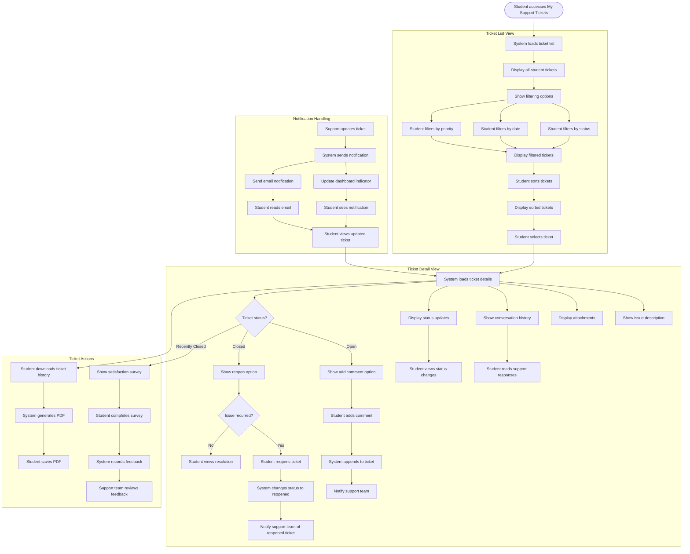

# US11.5: Support Ticket Management

## User Story

**As a** student  
**I want to** manage and track my support tickets  
**So that** I can stay informed about the status of my reported issues

## Acceptance Criteria

1. Students can access a "My Support Tickets" section from their dashboard
2. Ticket list displays:
   - Ticket number
   - Issue title
   - Submission date
   - Current status (New, In Progress, Waiting for Info, Resolved)
   - Priority level
   - Last update time
3. Students can sort and filter tickets by status, date, and priority
4. Clicking a ticket shows detailed view with:
   - Complete issue description
   - Attachments
   - Full conversation history with support team
   - Status updates and internal notes shared by support
5. Students can add comments or additional information to open tickets
6. System notifies students of ticket status changes via dashboard and email
7. Students can reopen recently closed tickets if issue recurs
8. Students can download ticket history as PDF for reference
9. System provides satisfaction survey when tickets are resolved
10. Ticket management interface is responsive and works on all devices

## Flow Diagram

## Details

**Story Points:** 3  
**Priority:** Medium  
**Epic:** [Epic 11: Requesting Support & Q&A Forum](./README.md)

## Implementation Notes

- Design an intuitive ticket management interface with clear status indicators
- Implement a filtering and sorting system for ticket lists
- Create a detailed ticket view with complete conversation history
- Implement a comment system for adding information to existing tickets
- Design a notification system for ticket updates
- Create a PDF generation system for ticket history
- Implement a satisfaction survey for closed tickets
- Design a reopening mechanism for recently closed tickets
- Create analytics to track ticket resolution times and satisfaction
- Implement email notifications for ticket updates
- Design a responsive interface that works across devices
- Create a system for attaching files to ticket comments
- Implement accessibility features for all ticket management elements
- Design clear visual indicators for different ticket statuses
