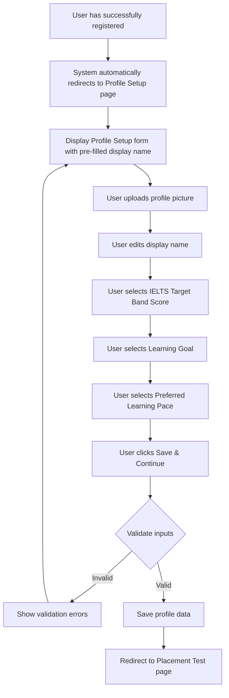

# Profile Setup

## User Story

**As a** newly registered student  
**I want to** set up my profile with my learning preferences  
**So that** I can receive a personalized learning experience tailored to my IELTS goals

## Acceptance Criteria

1. After successful registration, system automatically redirects me to the Profile Setup page
2. The profile setup form pre-fills my display name from registration data
3. I can upload a profile picture (optional)
4. I can select my IELTS Target Band Score from a range of 5.0 to 7.5
5. I can choose my Learning Goal (Study, Work, Migration) that best fits my purpose
6. I can set my Preferred Learning Pace (Intensive, Standard, Flexible) based on my availability
7. The system stores my preferences securely and uses them to customize my learning path
8. Upon completing my profile setup, I am immediately directed to the Placement Test
9. I can later edit these preferences from my account settings if my goals change

## User Flow

## Implementation Details

- **Profile Picture**: Image upload component with preview and crop functionality
- **Display Name**: Text field (pre-filled with name from registration)
- **IELTS Target Band Score**: Dropdown with options from 5.0 to 7.5 in 0.5 increments
- **Learning Goal**: Radio buttons (Study, Work, Migration)
- **Preferred Learning Pace**: Radio buttons (Intensive, Standard, Flexible)
- **Save & Continue**: Primary action button

## Validation Rules

- Display Name is required and must be 2-50 characters
- IELTS Target Band Score is required
- Learning Goal is required
- Preferred Learning Pace is required
- Profile Picture is optional but must be valid image file (JPG, PNG) under 5MB if provided

## Technical Considerations

- Store user preferences in user profile database table
- Cache preferences for quick access throughout the application
- Ensure mobile-responsive design for all form elements
- Support image uploading on mobile devices
