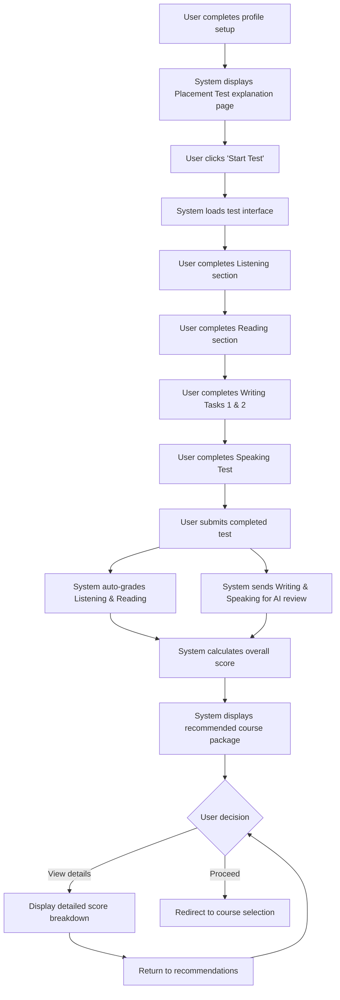

# Epic 4: IELTS Placement Test

## Epic Description

**As a** new student  
**I want to** take an IELTS placement test  
**So that** I can choose the right course package for my level

## Epic Overview

This epic covers the entire IELTS placement test process, from introduction to results and recommendations. The test will assess students' abilities in all four IELTS components (Listening, Reading, Writing, and Speaking) and provide appropriate course recommendations based on performance.

**Epic Points:** 29  
**Priority:** High  
**Dependencies:** Epic 3 - Profile Setup

## User Stories

This epic contains the following user stories:

1. [US4.1: Placement Test Introduction](./us4.1-placement-test-introduction.md)
2. [US4.2: Listening Section](./us4.2-listening-section.md)
3. [US4.3: Reading Section](./us4.3-reading-section.md)
4. [US4.4: Writing Section](./us4.4-writing-section.md)
5. [US4.5: Speaking Section](./us4.5-speaking-section.md)
6. [US4.6: Test Results and Recommendations](./us4.6-test-results-recommendations.md)

---

## Epic Flow Diagram

## Technical Considerations

- Ensure audio playback and recording works across browsers and devices
- Implement auto-save functionality to prevent data loss
- Optimize loading times for audio and text content
- Secure transmission of test responses
- Implement caching for test progress in case of connection issues
- Design for accessibility, including screen readers and keyboard navigation
