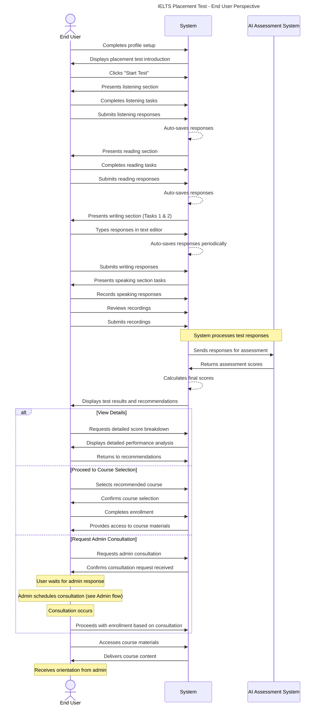
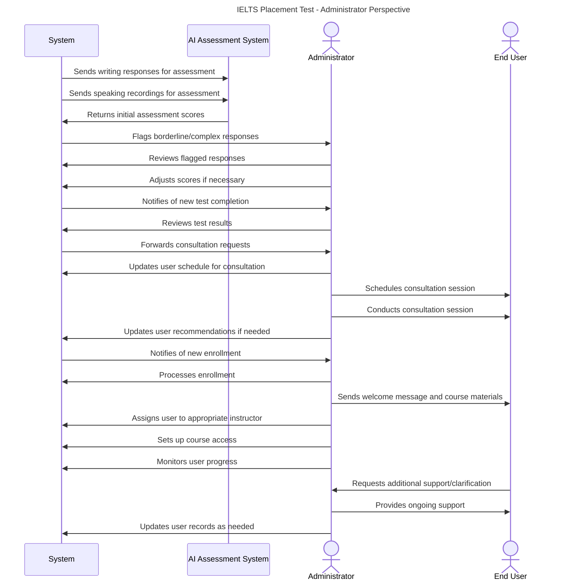

```mermaid
sequenceDiagram
    title IELTS Placement Test - End User Perspective

    actor EU as End User
    participant S as System
    participant AI as AI Assessment System

    %% Test Introduction
    EU->>S: Completes profile setup
    S->>EU: Displays placement test introduction
    EU->>S: Clicks "Start Test"

    %% Listening Section
    S->>EU: Presents listening section
    EU->>S: Completes listening tasks
    EU->>S: Submits listening responses
    S-->>S: Auto-saves responses

    %% Reading Section
    S->>EU: Presents reading section
    EU->>S: Completes reading tasks
    EU->>S: Submits reading responses
    S-->>S: Auto-saves responses

    %% Writing Section
    S->>EU: Presents writing section (Tasks 1 & 2)
    EU->>S: Types responses in text editor
    S-->>S: Auto-saves responses periodically
    EU->>S: Submits writing responses

    %% Speaking Section
    S->>EU: Presents speaking section tasks
    EU->>S: Records speaking responses
    EU->>S: Reviews recordings
    EU->>S: Submits recordings

    %% System Processing
    Note over S,AI: System processes test responses
    S->>AI: Sends responses for assessment
    AI->>S: Returns assessment scores
    S-->>S: Calculates final scores

    %% Results and Course Selection
    S->>EU: Displays test results and recommendations

    alt View Details
        EU->>S: Requests detailed score breakdown
        S->>EU: Displays detailed performance analysis
        EU->>S: Returns to recommendations
    else Proceed to Course Selection
        EU->>S: Selects recommended course
        S->>EU: Confirms course selection
        EU->>S: Completes enrollment
        S->>EU: Provides access to course materials
    else Request Admin Consultation
        EU->>S: Requests admin consultation
        S->>EU: Confirms consultation request received
        Note over EU: User waits for admin response
        Note over EU: Admin schedules consultation (see Admin flow)
        Note over EU: Consultation occurs
        EU->>S: Proceeds with enrollment based on consultation
    end

    %% Course Access
    EU->>S: Accesses course materials
    S->>EU: Delivers course content
    Note over EU: Receives orientation from admin
```

```mermaid
sequenceDiagram
    title IELTS Placement Test - Administrator Perspective

    participant S as System
    participant AI as AI Assessment System
    actor A as Administrator
    actor EU as End User

    %% Test Submission Processing
    S->>AI: Sends writing responses for assessment
    S->>AI: Sends speaking recordings for assessment
    AI->>S: Returns initial assessment scores

    %% Admin Review Process
    S->>A: Flags borderline/complex responses
    A->>S: Reviews flagged responses
    A->>S: Adjusts scores if necessary

    %% Admin Notifications and Actions
    S->>A: Notifies of new test completion
    A->>S: Reviews test results

    %% Admin Consultation Handling
    S->>A: Forwards consultation requests
    A->>S: Updates user schedule for consultation
    A->>EU: Schedules consultation session
    A->>EU: Conducts consultation session
    A->>S: Updates user recommendations if needed

    %% Enrollment Management
    S->>A: Notifies of new enrollment
    A->>S: Processes enrollment
    A->>EU: Sends welcome message and course materials
    A->>S: Assigns user to appropriate instructor

    %% Course Setup and Monitoring
    A->>S: Sets up course access
    A->>S: Monitors user progress

    %% Ongoing Support
    EU->>A: Requests additional support/clarification
    A->>EU: Provides ongoing support
    A->>S: Updates user records as needed
```
