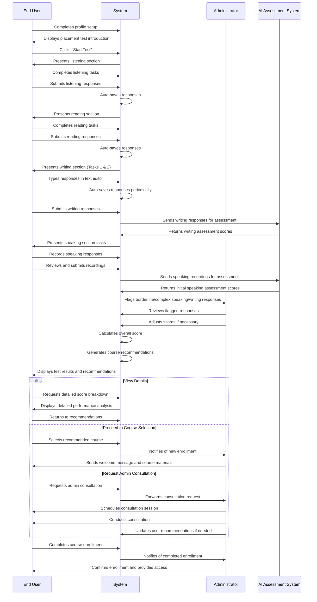

```mermaid
sequenceDiagram
    participant User as End User
    participant System
    participant Admin as Administrator
    participant AI as AI Assessment System

    %% Test Introduction
    User->>System: Completes profile setup
    System->>User: Displays placement test introduction
    User->>System: Clicks "Start Test"

    %% Listening Section
    System->>User: Presents listening section
    User->>System: Completes listening tasks
    User->>System: Submits listening responses
    System->>System: Auto-saves responses

    %% Reading Section
    System->>User: Presents reading section
    User->>System: Completes reading tasks
    User->>System: Submits reading responses
    System->>System: Auto-saves responses

    %% Writing Section
    System->>User: Presents writing section (Tasks 1 & 2)
    User->>System: Types responses in text editor
    System->>System: Auto-saves responses periodically
    User->>System: Submits writing responses
    System->>AI: Sends writing responses for assessment
    AI->>System: Returns writing assessment scores

    %% Speaking Section
    System->>User: Presents speaking section tasks
    User->>System: Records speaking responses
    User->>System: Reviews and submits recordings
    System->>AI: Sends speaking recordings for assessment
    AI->>System: Returns initial speaking assessment scores

    %% Admin Review (for borderline or complex cases)
    System->>Admin: Flags borderline/complex speaking/writing responses
    Admin->>System: Reviews flagged responses
    Admin->>System: Adjusts scores if necessary

    %% Results Processing
    System->>System: Calculates overall score
    System->>System: Generates course recommendations

    %% Results Presentation
    System->>User: Displays test results and recommendations

    %% User Decision Path
    alt View Details
        User->>System: Requests detailed score breakdown
        System->>User: Displays detailed performance analysis
        User->>System: Returns to recommendations
    else Proceed to Course Selection
        User->>System: Selects recommended course
        System->>Admin: Notifies of new enrollment
        Admin->>User: Sends welcome message and course materials
    else Request Admin Consultation
        User->>System: Requests admin consultation
        System->>Admin: Forwards consultation request
        Admin->>User: Schedules consultation session
        Admin->>User: Conducts consultation
        Admin->>System: Updates user recommendations if needed
    end

    %% Course Enrollment
    User->>System: Completes course enrollment
    System->>Admin: Notifies of completed enrollment
    Admin->>User: Confirms enrollment and provides access
```
