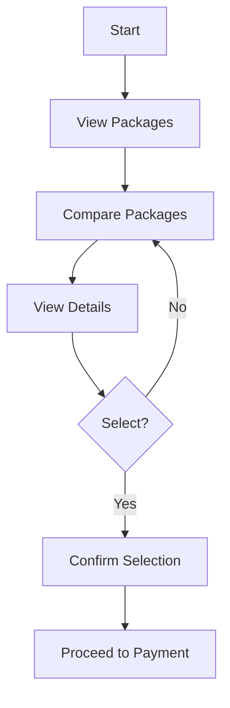

# Epic 5: Course Selection

## Epic Description

**As a** student  
**I want to** choose a course package  
**So that** I can enroll in a program suited to my level

## Epic Overview

This epic covers the course selection process, allowing students to browse, compare, and select appropriate course packages based on their placement test results or personal preferences. The system will provide detailed information about each package and guide users through the selection process to payment.

**Epic Points:** 21  
**Priority:** High  
**Dependencies:** Epic 4 - IELTS Placement Test

## User Stories

This epic contains the following user stories:

1. [US5.1: Course Package Overview](./us5.1-course-package-overview.md)
2. [US5.2: Package Comparison](./us5.2-package-comparison.md)
3. [US5.3: Package Details](./us5.3-package-details.md)
4. [US5.4: Package Selection](./us5.4-package-selection.md)
5. [US5.5: Transition to Payment](./us5.5-transition-to-payment.md)

---

## Epic Flow Diagram

## Technical Considerations

- Implement responsive design for package comparison on different devices
- Ensure clear visual differentiation between package tiers
- Cache user selections to prevent data loss during navigation
- Implement smooth transitions between selection and payment screens
- Ensure accessibility for all package information
- Track user interactions for analytics on package popularity
- Implement personalized recommendations based on placement test results
