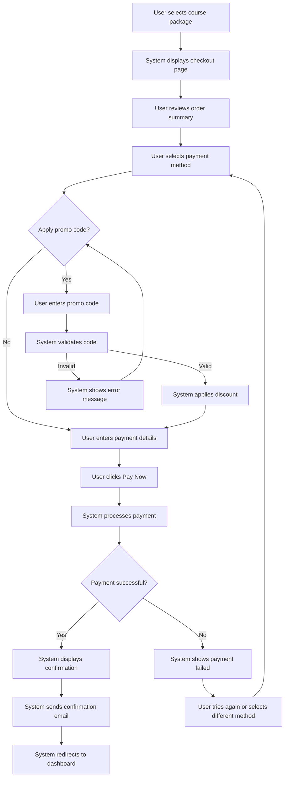

# Epic 6: Payment

## Epic Description

**As a** student  
**I want to** complete payment  
**So that** I can start learning immediately

## Epic Overview

This epic covers the entire payment process, from checkout to confirmation. The system will provide multiple payment options including both Vietnamese and international payment methods, process transactions securely, and provide immediate confirmation and access to learning materials upon successful payment.

**Epic Points:** 21  
**Priority:** High  
**Dependencies:** Epic 5 - Course Selection

## User Stories

This epic contains the following user stories:

1. [US6.1: Checkout Page](./us6.1-checkout-page.md)
2. [US6.2: Payment Methods](./us6.2-payment-methods.md)
3. [US6.3: Promo Code Application](./us6.3-promo-code-application.md)
4. [US6.4: Payment Processing](./us6.4-payment-processing.md)
5. [US6.5: Payment Confirmation](./us6.5-payment-confirmation.md)

---

## Epic Flow Diagram

## Technical Considerations

- Implement secure payment processing with encryption
- Support multiple payment gateways (international credit cards, PayPal, MoMo, ZaloPay)
- Ensure PCI compliance for all payment processing
- Implement real-time payment verification
- Design mobile-responsive checkout pages
- Provide clear error messages for failed payments
- Implement session timeout handling during payment
- Create secure promo code validation system
- Ensure accessibility for all payment interfaces
