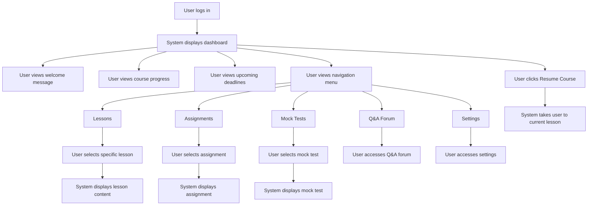

# Epic 7: Dashboard & Course Navigation

## Epic Description

**As a** student  
**I want to** access my learning dashboard  
**So that** I can track my progress and start my lessons

## Epic Overview

This epic covers the student dashboard and course navigation experience. The system will provide students with a comprehensive dashboard that displays their course progress, upcoming deadlines, and quick access to continue their learning journey. The navigation system will allow students to easily move between different sections of the course and track their overall progress.

**Epic Points:** 18  
**Priority:** High  
**Dependencies:** Epic 1 - Authentication, Epic 5 - Course Selection

## User Stories

This epic contains the following user stories:

1. [US7.1: Dashboard Overview](./us7.1-dashboard-overview.md)
2. [US7.2: Course Progress Tracking](./us7.2-course-progress-tracking.md)
3. [US7.3: Course Navigation Menu](./us7.3-course-navigation-menu.md)
4. [US7.4: Upcoming Deadlines & Schedule](./us7.4-upcoming-deadlines-schedule.md)
5. [US7.5: Resume Learning Functionality](./us7.5-resume-learning-functionality.md)

---

## Epic Flow Diagram

## Technical Considerations

- Implement responsive dashboard design for all device sizes
- Create efficient data loading to minimize dashboard load time
- Implement progress tracking algorithms to accurately display course completion
- Design intuitive navigation with clear visual hierarchy
- Ensure accessibility compliance for all dashboard elements
- Implement caching for frequently accessed dashboard data
- Create smooth transitions between dashboard and course content
- Design for internationalization to support multiple languages
- Implement analytics to track user engagement with dashboard elements
