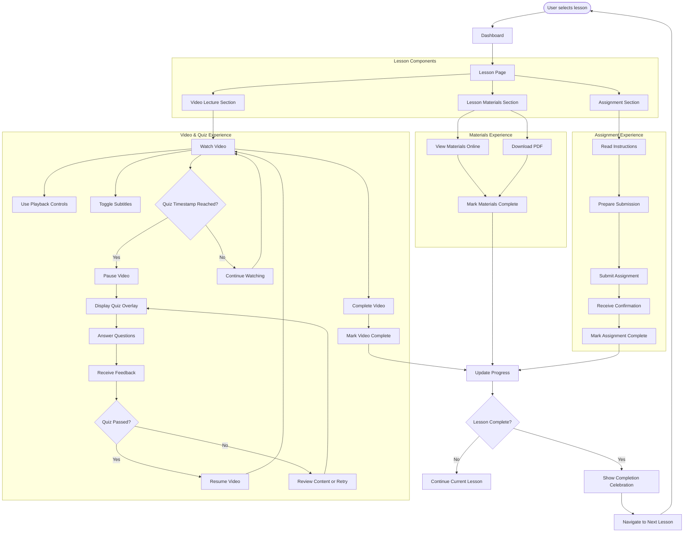

# Epic 8: Lesson Experience

## Epic Description

**As a** student  
**I want to** access and complete my lessons  
**So that** I can learn effectively at my own pace

## Epic Overview

This epic covers the core learning experience for students, focusing on how they access, interact with, and complete lessons. The system will provide an engaging and intuitive lesson interface with video lectures that include integrated quizzes at key learning points. These quizzes will appear at strategic timestamps during video playback to verify student understanding before allowing them to continue. The lesson experience also includes downloadable materials, assignment submission capabilities, and comprehensive progress tracking. The lesson experience is designed to be self-paced, allowing students to learn according to their own schedule while ensuring they master the content through interactive verification.

**Epic Points:** 24  
**Priority:** Critical  
**Dependencies:** Epic 7 - Dashboard & Course Navigation

## User Stories

This epic contains the following user stories:

1. [US8.1: Lesson Interface](./us8.1-lesson-interface.md)
2. [US8.2: Video Lecture Experience](./us8.2-video-lecture-experience.md)
3. [US8.3: Lesson Materials & Resources](./us8.3-lesson-materials-resources.md)
4. [US8.4: Interactive Video Quizzes](./us8.4-interactive-quizzes.md)
5. [US8.5: Assignment Submission](./us8.5-assignment-submission.md)
6. [US8.6: Lesson Progress Tracking](./us8.6-lesson-progress-tracking.md)

---

## Epic Flow Diagram

## Technical Considerations

- Implement responsive video player compatible across devices
- Ensure video streaming optimizes for different network conditions
- Implement secure PDF generation and download functionality
- Design interactive quiz system that integrates with video timestamps
- Create smooth transitions between video playback and quiz overlays
- Implement mechanism to prevent users from skipping required quizzes
- Create secure file upload system for assignments
- Implement progress tracking that persists across sessions
- Ensure all lesson content is accessible (captions, transcripts, etc.)
- Optimize page load times for lesson content
- Implement offline access capabilities where possible
- Design for internationalization to support multiple languages
- Ensure mobile-friendly experience for all lesson components
- Implement analytics to track engagement with different lesson elements
- Design remedial content for users who struggle with specific concepts
