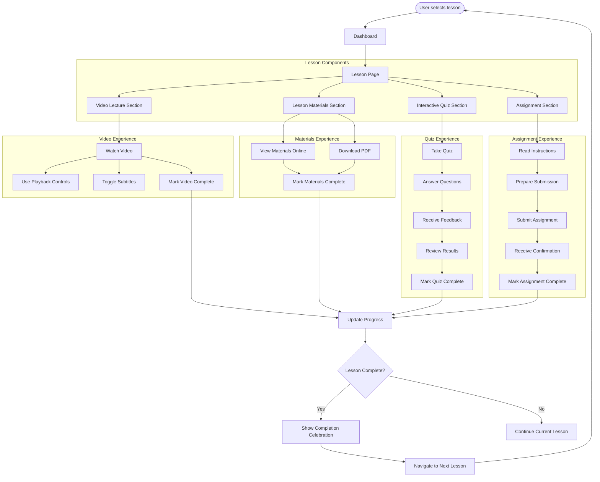

# Epic 8: Lesson Experience

## Epic Description

**As a** student  
**I want to** access and complete my lessons  
**So that** I can learn effectively at my own pace

## Epic Overview

This epic covers the core learning experience for students, focusing on how they access, interact with, and complete lessons. The system will provide an engaging and intuitive lesson interface with video lectures, downloadable materials, interactive quizzes, and assignment submission capabilities. The lesson experience is designed to be self-paced, allowing students to learn according to their own schedule while providing all necessary tools for effective learning.

**Epic Points:** 21  
**Priority:** Critical  
**Dependencies:** Epic 7 - Dashboard & Course Navigation

## User Stories

This epic contains the following user stories:

1. [US8.1: Lesson Interface](./us8.1-lesson-interface.md)
2. [US8.2: Video Lecture Experience](./us8.2-video-lecture-experience.md)
3. [US8.3: Lesson Materials & Resources](./us8.3-lesson-materials-resources.md)
4. [US8.4: Interactive Quizzes](./us8.4-interactive-quizzes.md)
5. [US8.5: Assignment Submission](./us8.5-assignment-submission.md)
6. [US8.6: Lesson Progress Tracking](./us8.6-lesson-progress-tracking.md)

---

## Epic Flow Diagram

## Technical Considerations

- Implement responsive video player compatible across devices
- Ensure video streaming optimizes for different network conditions
- Implement secure PDF generation and download functionality
- Design interactive quiz system with immediate feedback
- Create secure file upload system for assignments
- Implement progress tracking that persists across sessions
- Ensure all lesson content is accessible (captions, transcripts, etc.)
- Optimize page load times for lesson content
- Implement offline access capabilities where possible
- Design for internationalization to support multiple languages
- Ensure mobile-friendly experience for all lesson components
- Implement analytics to track engagement with different lesson elements
