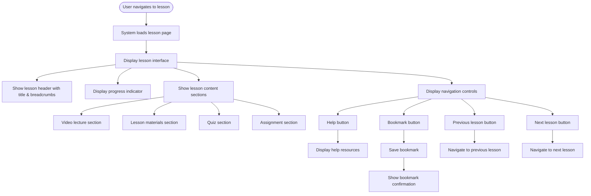

# US8.1: Lesson Interface

## User Story

**As a** student  
**I want to** have an intuitive and engaging lesson interface  
**So that** I can easily navigate and interact with the lesson content

## Acceptance Criteria

1. Lesson page loads quickly (under 3 seconds)
2. Interface includes clearly organized sections for:
   - Video lecture
   - Lesson notes/materials
   - Interactive quiz (if applicable)
   - Assignment submission section
3. Navigation between lesson sections is intuitive
4. Interface is responsive and works on all devices (desktop, tablet, mobile)
5. Lesson progress is clearly indicated
6. Next/previous lesson navigation is easily accessible
7. Interface includes a breadcrumb trail showing lesson position in course
8. User can bookmark specific points in the lesson for later reference
9. Interface includes a "Help" option for technical assistance

## Flow Diagram

## Details

**Story Points:** 5  
**Priority:** Critical  
**Epic:** [Epic 8: Lesson Experience](./README.md)

## Implementation Notes

- Design a clean, distraction-free lesson interface
- Implement responsive design for all device sizes
- Use clear visual hierarchy to guide users through the lesson
- Implement smooth transitions between lesson sections
- Ensure all interface elements are accessible
- Optimize page load times for lesson content
- Implement proper error handling for content loading issues
- Add analytics tracking for lesson engagement
- Test interface usability with actual students
- Consider implementing dark mode option for reduced eye strain
