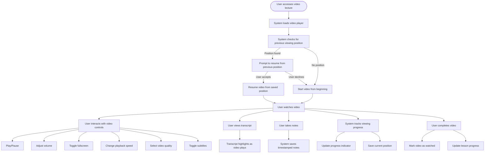

# US8.2: Video Lecture Experience

## User Story

**As a** student  
**I want to** watch video lectures with comprehensive controls  
**So that** I can learn at my own pace and comprehend the content fully

## Acceptance Criteria

1. Video player includes standard controls:
   - Play/pause
   - Volume control
   - Fullscreen toggle
   - Playback speed adjustment (0.5x to 2x)
   - Video quality selection
2. Video player supports subtitles/closed captions in multiple languages
3. Video player includes a progress bar with preview thumbnails
4. System remembers where the user left off and resumes from that point
5. Videos load quickly and adapt to user's connection speed
6. Video player includes a transcript that highlights text as the video plays
7. User can take timestamped notes while watching the video
8. Video player works consistently across all major browsers and devices
9. Videos can be downloaded for offline viewing (where permitted)

## Flow Diagram

## Details

**Story Points:** 5  
**Priority:** Critical  
**Epic:** [Epic 8: Lesson Experience](./README.md)

## Implementation Notes

- Implement a responsive, accessible video player
- Ensure video streaming optimizes for different network conditions
- Implement adaptive bitrate streaming for smooth playback
- Create a system for managing subtitles in multiple languages
- Implement secure video delivery to prevent unauthorized downloads
- Design mobile-friendly video controls
- Implement analytics to track video engagement (completion rates, drop-off points)
- Ensure videos are properly compressed without quality loss
- Consider implementing picture-in-picture mode for multitasking
- Test video player across different devices, browsers, and connection speeds
