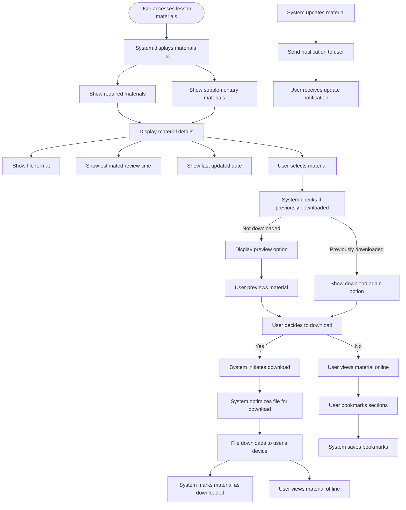

# US8.3: Lesson Materials & Resources

## User Story

**As a** student  
**I want to** access and download lesson materials and resources  
**So that** I can study offline and reference important information

## Acceptance Criteria

1. Each lesson includes downloadable PDF notes
2. System provides a preview of PDF content before download
3. Downloads are optimized for quick access (file size optimization)
4. System tracks which materials have been downloaded by the user
5. Additional resources are clearly categorized (required vs. supplementary)
6. Resources are available in multiple formats where appropriate (PDF, DOCX, etc.)
7. System provides estimated reading/review time for each resource
8. User can bookmark specific sections within online materials
9. Materials are accessible on all devices
10. System notifies users when materials are updated

## Flow Diagram

## Details

**Story Points:** 3  
**Priority:** High  
**Epic:** [Epic 8: Lesson Experience](./README.md)

## Implementation Notes

- Implement secure PDF generation and download functionality
- Optimize file sizes for mobile downloads
- Create a document viewer for in-browser reading
- Implement bookmarking functionality within documents
- Design a clear organization system for different types of materials
- Ensure all downloadable content is properly versioned
- Implement accessibility features for all document types
- Create a system to track material usage for analytics
- Consider implementing offline synchronization for mobile apps
- Ensure materials are printable with proper formatting
