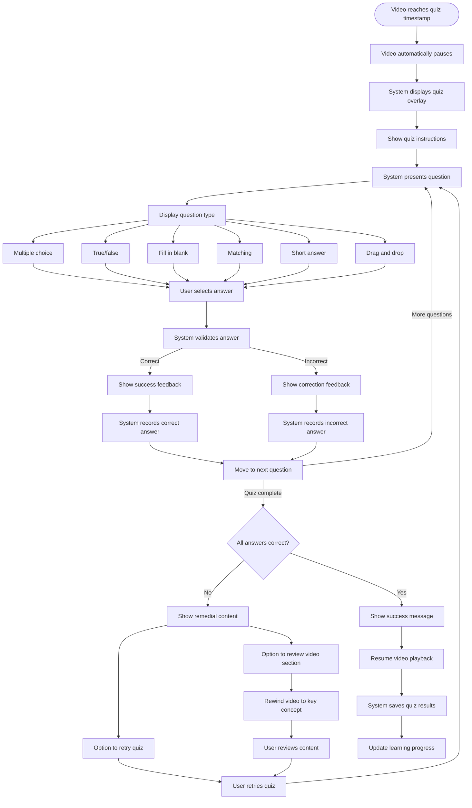

# US8.4: Interactive Video Quizzes

## User Story

**As a** student  
**I want to** take interactive quizzes during video lectures at key learning points  
**So that** I can verify my understanding before continuing with the lesson

## Acceptance Criteria

1. Quizzes appear at strategic timestamps during video lectures
2. Quizzes support multiple question types:
   - Multiple choice
   - True/false
   - Fill in the blank
   - Matching
   - Short answer
   - Drag and drop
3. System provides immediate feedback after each question
4. Feedback includes explanations for correct and incorrect answers
5. User must successfully complete quizzes to continue with the video
6. System tracks quiz performance and shows progress over time
7. Quizzes adapt to user's performance level (optional)
8. User can review all quiz questions and answers after completing the video
9. Quiz interface is intuitive and responsive on all devices
10. Quizzes include accessibility features for all users
11. Video playback automatically pauses when quizzes appear
12. Video resumes automatically after successful quiz completion

## Flow Diagram

## Details

**Story Points:** 8  
**Priority:** High  
**Epic:** [Epic 8: Lesson Experience](./README.md)

## Implementation Notes

- Design an engaging, gamified quiz interface that overlays the video player
- Implement a flexible quiz engine supporting multiple question types
- Create a system for providing detailed feedback
- Implement secure quiz submission and validation
- Design mobile-friendly quiz interactions
- Implement analytics to track quiz performance
- Create a question bank system for randomization
- Ensure all quiz elements are accessible
- Implement spaced repetition for previously incorrect answers
- Develop a system to define and manage quiz timestamps within videos
- Create smooth transitions between video playback and quiz display
- Implement a mechanism to prevent users from skipping quizzes
- Design remedial content for users who struggle with specific concepts
- Test quiz functionality across different devices and browsers
- Ensure quiz overlay works properly in fullscreen video mode
