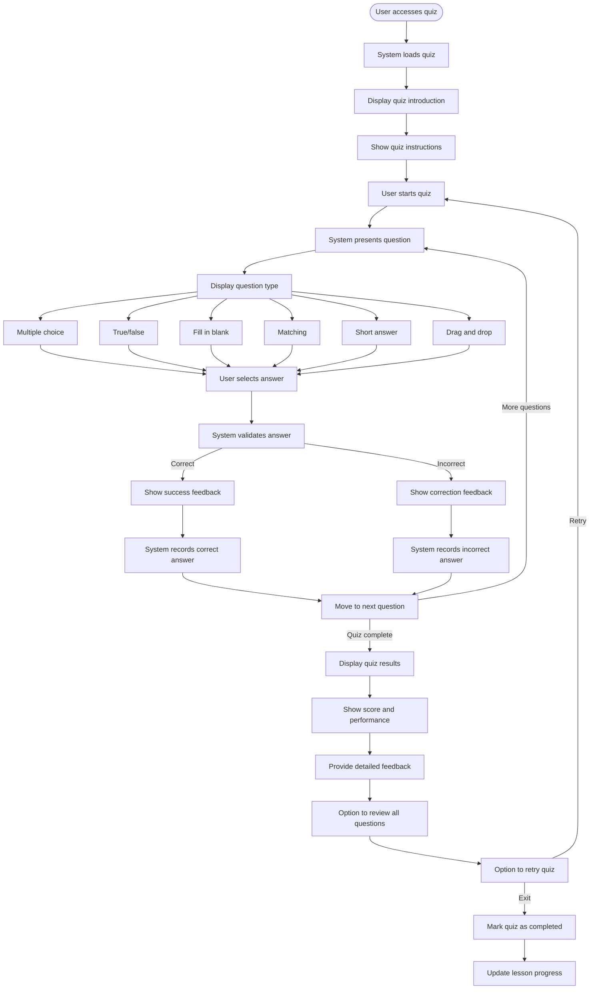

# US8.4: Interactive Quizzes

## User Story

**As a** student  
**I want to** take interactive quizzes during lessons  
**So that** I can test my understanding and reinforce my learning

## Acceptance Criteria

1. Lessons include interactive quizzes at appropriate points
2. Quizzes support multiple question types:
   - Multiple choice
   - True/false
   - Fill in the blank
   - Matching
   - Short answer
   - Drag and drop
3. System provides immediate feedback after each question
4. Feedback includes explanations for correct and incorrect answers
5. User can retry quizzes multiple times
6. System tracks quiz performance and shows progress over time
7. Quizzes adapt to user's performance level (optional)
8. User can review all quiz questions and answers after completion
9. Quiz interface is intuitive and responsive on all devices
10. Quizzes include accessibility features for all users

## Flow Diagram

## Details

**Story Points:** 5  
**Priority:** High  
**Epic:** [Epic 8: Lesson Experience](./README.md)

## Implementation Notes

- Design an engaging, gamified quiz interface
- Implement a flexible quiz engine supporting multiple question types
- Create a system for providing detailed feedback
- Implement secure quiz submission and validation
- Design mobile-friendly quiz interactions
- Implement analytics to track quiz performance
- Create a question bank system for randomization
- Ensure all quiz elements are accessible
- Implement spaced repetition for previously incorrect answers
- Consider implementing timed quizzes for exam preparation
- Test quiz functionality across different devices and browsers
