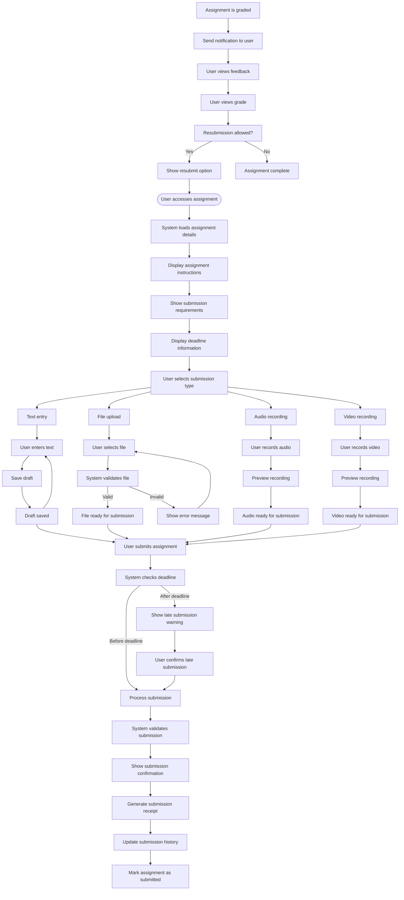

# US8.5: Assignment Submission

## User Story

**As a** student  
**I want to** submit assignments directly within the lesson interface  
**So that** I can complete my coursework and receive feedback

## Acceptance Criteria

1. Lesson includes a clearly marked assignment submission section
2. Assignment instructions are clearly displayed with all requirements
3. System supports multiple submission types:
   - Text entry (for writing tasks)
   - File upload (documents, images, audio)
   - Audio recording (for speaking tasks)
   - Video recording (for presentations)
4. User can save drafts before final submission
5. System confirms successful submission with a receipt
6. User can view submission history and status
7. User receives notifications when assignments are graded
8. User can view feedback and grades within the lesson interface
9. System enforces assignment deadlines with appropriate warnings
10. User can resubmit assignments if allowed by course settings

## Flow Diagram

## Details

**Story Points:** 5  
**Priority:** High  
**Epic:** [Epic 8: Lesson Experience](./README.md)

## Implementation Notes

- Implement secure file upload system with virus scanning
- Create in-browser text editor with autosave functionality
- Implement in-browser audio/video recording capabilities
- Design clear submission workflow with confirmation steps
- Create a robust submission tracking system
- Implement deadline enforcement with timezone awareness
- Design a feedback display system that highlights key points
- Ensure all submission methods are accessible
- Implement plagiarism detection for text submissions
- Create a notification system for submission status updates
- Test submission functionality across different devices and connection speeds
