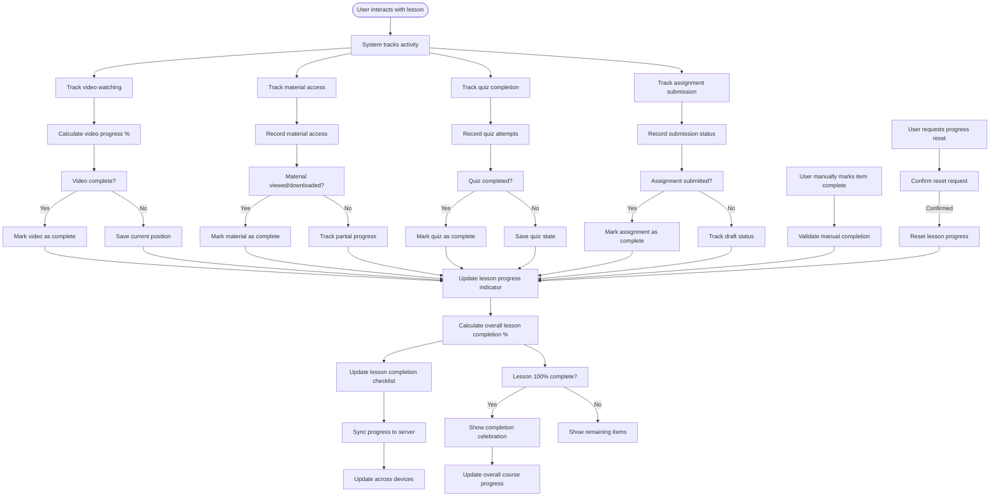

# US8.6: Lesson Progress Tracking

## User Story

**As a** student  
**I want to** track my progress within each lesson  
**So that** I know what I've completed and what remains to be done

## Acceptance Criteria

1. System tracks completion status of each lesson component:
   - Video watched (including percentage viewed)
   - Materials downloaded/viewed
   - Quizzes completed
   - Assignments submitted
2. Progress is visually indicated within the lesson interface
3. System automatically marks components as complete when finished
4. User can manually mark components as complete if desired
5. Progress persists across sessions and devices
6. System provides a lesson completion checklist
7. User receives a notification/celebration when lesson is fully completed
8. Lesson progress contributes to overall course progress tracking
9. User can reset progress for a lesson if needed
10. Progress tracking works in offline mode and syncs when reconnected

## Flow Diagram

## Details

**Story Points:** 3  
**Priority:** High  
**Epic:** [Epic 8: Lesson Experience](./README.md)

## Implementation Notes

- Implement robust progress tracking algorithms
- Design clear visual indicators for completion status
- Create a secure data storage system for progress information
- Implement cross-device synchronization
- Design engaging completion celebrations/badges
- Ensure progress tracking works with offline access
- Implement analytics to identify common completion patterns
- Create a system for manual progress adjustment (admin/support)
- Test progress tracking across different user scenarios
- Ensure progress data is included in user backups
