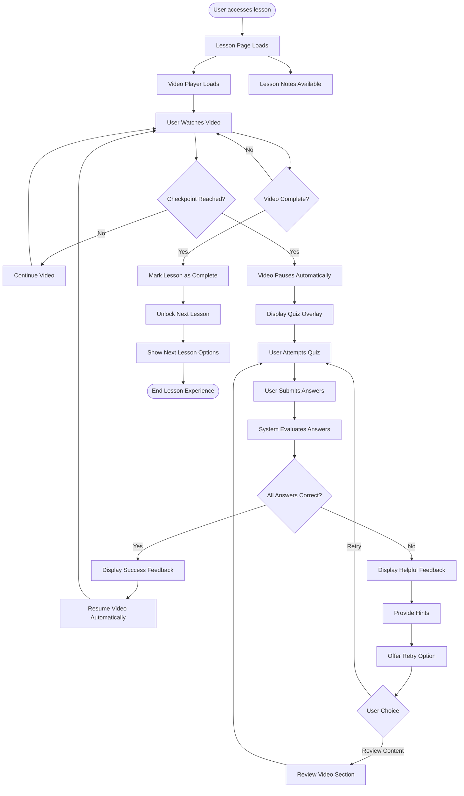

# Epic 9: Lesson Interactions

## Epic Description

**As a** student  
**I want to** interact with lessons through quizzes and checkpoints  
**So that** I can reinforce my understanding before moving forward

## Epic Overview

This epic focuses on the interactive elements within lessons that verify and reinforce student understanding. The system will integrate quizzes and checkpoints at strategic points throughout video lessons, ensuring students grasp key concepts before progressing. When a student reaches a designated checkpoint in a video, the system will automatically pause playback and present an interactive quiz. Based on the student's performance, the system will either allow them to continue or provide remedial content to address knowledge gaps. These interactions create a more engaging learning experience and ensure students master the material before moving to more advanced concepts.

**Epic Points:** 21  
**Priority:** High  
**Dependencies:** Epic 8 - Lesson Experience

## User Stories

This epic contains the following user stories:

1. [US9.1: Quiz Checkpoints](./us9.1-quiz-checkpoints.md)
2. [US9.2: Adaptive Feedback](./us9.2-adaptive-feedback.md)
3. [US9.3: Knowledge Reinforcement](./us9.3-knowledge-reinforcement.md)
4. [US9.4: Progress Gating](./us9.4-progress-gating.md)
5. [US9.5: Performance Analytics](./us9.5-performance-analytics.md)

---

## Epic Flow Diagram

## Technical Considerations

- Design a seamless integration between video player and quiz system
- Implement checkpoint triggers at specific video timestamps
- Create smooth transitions between video content and quiz overlays
- Design an adaptive feedback system that provides helpful guidance
- Implement a progress gating mechanism that ensures concept mastery
- Create a system to track quiz performance and identify knowledge gaps
- Design remedial content that targets specific misconceptions
- Ensure all quiz interactions are accessible to all users
- Optimize quiz loading to prevent delays in the learning experience
- Implement analytics to track quiz performance and identify difficult concepts
- Design mobile-friendly quiz interactions that work on all devices
- Create a database structure to store quiz results and learning analytics
- Implement a system to dynamically adjust quiz difficulty based on performance
- Ensure offline synchronization of quiz results when connectivity is restored
