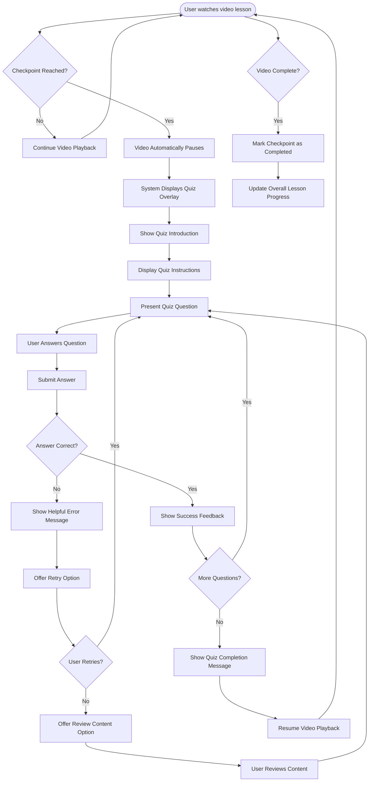

# US9.1: Quiz Checkpoints

## User Story

**As a** student  
**I want to** encounter quiz checkpoints at key moments in video lessons  
**So that** I can verify my understanding of important concepts

## Acceptance Criteria

1. Video lessons include quiz checkpoints at strategic timestamps
2. Video automatically pauses when a checkpoint is reached
3. System displays a quiz overlay without requiring page navigation
4. Quiz overlay clearly indicates the concept being tested
5. Quizzes include various question types (multiple-choice, fill-in-blank, etc.)
6. System prevents video progression until quiz is successfully completed
7. Quiz checkpoints are visually indicated on the video progress bar
8. Users can see upcoming checkpoints in the lesson
9. Checkpoint quizzes are responsive and work on all devices
10. System provides keyboard navigation for accessibility

## Flow Diagram

## Details

**Story Points:** 5  
**Priority:** High  
**Epic:** [Epic 9: Lesson Interactions](./README.md)

## Implementation Notes

- Design a seamless integration between video player and quiz system
- Implement checkpoint triggers at specific video timestamps
- Create smooth transitions between video content and quiz overlays
- Ensure quiz overlay doesn't disrupt the video context
- Design clear visual indicators for checkpoints on the progress bar
- Implement a mechanism to prevent users from skipping checkpoints
- Create a database structure to store checkpoint configurations
- Ensure all quiz elements are accessible via keyboard navigation
- Optimize quiz loading to prevent delays in the learning experience
- Test checkpoint functionality across different devices and browsers
- Implement analytics to track checkpoint completion rates
