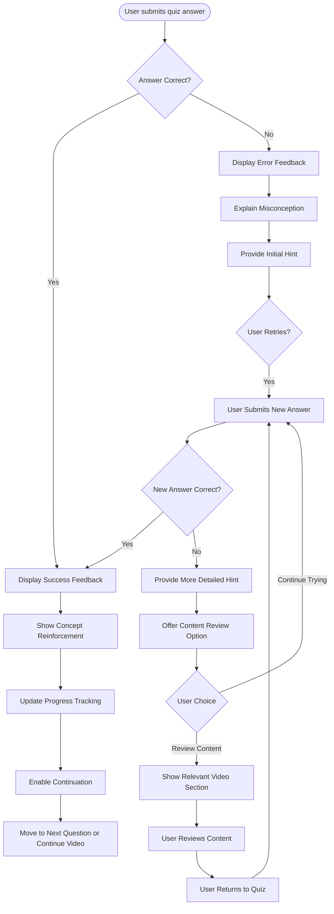

# US9.2: Adaptive Feedback

## User Story

**As a** student  
**I want to** receive immediate, helpful feedback on my quiz answers  
**So that** I can learn from my mistakes and improve my understanding

## Acceptance Criteria

1. System provides immediate feedback after quiz answer submission
2. For correct answers, feedback reinforces the concept with positive messaging
3. For incorrect answers, feedback explains why the answer is wrong
4. Feedback for incorrect answers includes hints toward the correct solution
5. System provides different levels of hints if user makes multiple attempts
6. Feedback includes visual cues (colors, icons) to indicate correctness
7. For complex concepts, feedback includes links to relevant lesson sections
8. Feedback is personalized based on common misconceptions
9. System tracks patterns in incorrect answers to improve future feedback
10. Feedback is accessible and works on all devices

## Flow Diagram

## Details

**Story Points:** 5  
**Priority:** High  
**Epic:** [Epic 9: Lesson Interactions](./README.md)

## Implementation Notes

- Design a feedback system that provides meaningful guidance
- Implement different feedback templates for various question types
- Create a hint system with progressive levels of assistance
- Develop a mechanism to link feedback to specific video sections
- Implement visual design that clearly distinguishes correct/incorrect states
- Create a database of common misconceptions and targeted feedback
- Design feedback that works well on mobile devices
- Implement analytics to track effectiveness of different feedback types
- Ensure all feedback is accessible to screen readers
- Create a system to personalize feedback based on user history
- Test feedback with actual students to ensure clarity and helpfulness
