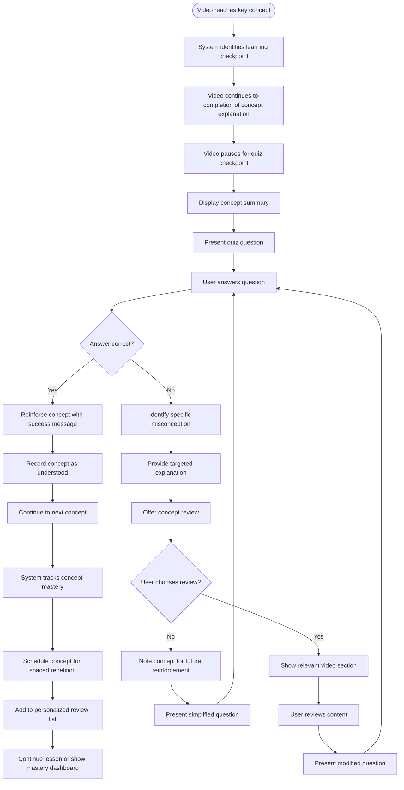

# US9.3: Knowledge Reinforcement

## User Story

**As a** student  
**I want to** have my knowledge reinforced through strategic quiz placement  
**So that** I can better retain important concepts and identify knowledge gaps

## Acceptance Criteria

1. Quizzes are strategically placed after key concept explanations in videos
2. System provides concept summaries before quiz questions
3. Quizzes include a mix of recall and application questions
4. System revisits previously challenging concepts in later checkpoints
5. Incorrect answers trigger targeted review opportunities
6. System provides spaced repetition by reintroducing concepts in later lessons
7. Quiz questions build on previous knowledge to reinforce connections
8. System offers optional additional practice for difficult concepts
9. Knowledge reinforcement adapts to individual learning patterns
10. Students can access a concept review dashboard showing mastery levels

## Flow Diagram

## Details

**Story Points:** 5  
**Priority:** High  
**Epic:** [Epic 9: Lesson Interactions](./README.md)

## Implementation Notes

- Design a knowledge mapping system that tracks concept relationships
- Implement spaced repetition algorithms for optimal reinforcement
- Create a system to identify key concepts within lesson content
- Develop a question bank that tests different levels of understanding
- Implement analytics to track concept mastery over time
- Design a visual mastery dashboard for students
- Create adaptive learning paths based on identified knowledge gaps
- Implement a system to generate targeted review content
- Ensure reinforcement strategies are based on learning science principles
- Design mobile-friendly knowledge reinforcement interactions
- Test reinforcement effectiveness through learning outcome measurements
