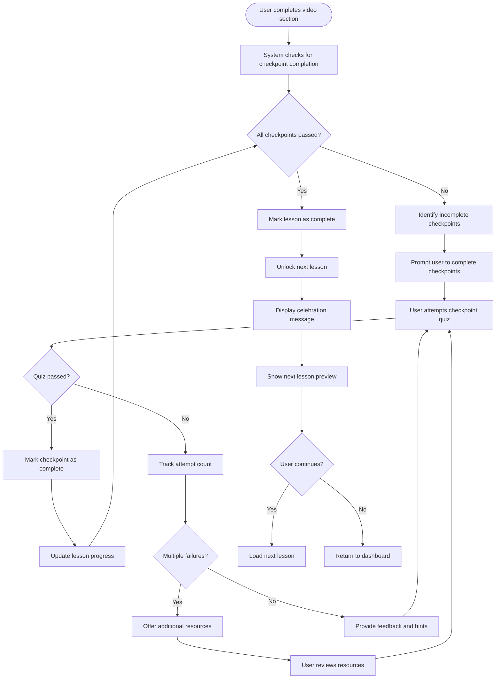

# US9.4: Progress Gating

## User Story

**As a** student  
**I want to** have my progress gated by knowledge checkpoints  
**So that** I can ensure I've mastered prerequisite concepts before moving forward

## Acceptance Criteria

1. System prevents progression to next lesson until current lesson is completed
2. Lesson completion requires successful passage of all checkpoint quizzes
3. System provides clear indication of locked/unlocked lesson status
4. Users can see their progress toward unlocking the next lesson
5. Critical checkpoints require a minimum score to pass
6. System allows multiple attempts at checkpoint quizzes
7. After multiple failed attempts, system offers additional learning resources
8. Progress gating is applied consistently across all lesson types
9. System provides encouraging messaging when lessons are unlocked
10. Instructors can configure gating requirements for different course levels

## Flow Diagram

## Details

**Story Points:** 3  
**Priority:** High  
**Epic:** [Epic 9: Lesson Interactions](./README.md)

## Implementation Notes

- Implement a robust lesson completion tracking system
- Design clear visual indicators for locked/unlocked content
- Create a progress visualization that shows completion requirements
- Implement configurable gating rules for different course types
- Design encouraging messaging for lesson unlocking
- Create a system to offer targeted resources after multiple failures
- Implement analytics to identify common progression blockers
- Ensure progress gating works consistently across devices
- Design accessible notifications for lesson status changes
- Create instructor tools to configure gating requirements
- Test progress gating with different user scenarios
