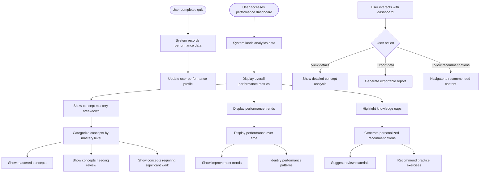

# US9.5: Performance Analytics

## User Story

**As a** student  
**I want to** see analytics about my quiz performance  
**So that** I can identify my strengths and areas for improvement

## Acceptance Criteria

1. System provides a performance dashboard showing quiz results
2. Dashboard displays overall success rate across all quizzes
3. Analytics show performance broken down by concept/topic
4. System identifies knowledge gaps based on quiz performance
5. Dashboard shows progress over time with visual graphs
6. Students can see which concepts they've mastered vs. need review
7. System provides personalized recommendations for improvement
8. Analytics are updated in real-time after each quiz attempt
9. Dashboard is accessible and works on all devices
10. Students can export or share their performance data

## Flow Diagram

## Details

**Story Points:** 3  
**Priority:** Medium  
**Epic:** [Epic 9: Lesson Interactions](./README.md)

## Implementation Notes

- Design an intuitive analytics dashboard with clear visualizations
- Implement data collection for all quiz interactions
- Create algorithms to identify knowledge gaps and patterns
- Develop a recommendation engine based on performance data
- Implement real-time dashboard updates
- Design mobile-responsive analytics views
- Create exportable report formats
- Implement secure data storage for performance metrics
- Ensure all visualizations are accessible
- Design clear navigation between analytics and recommended content
- Test dashboard usability with actual students
