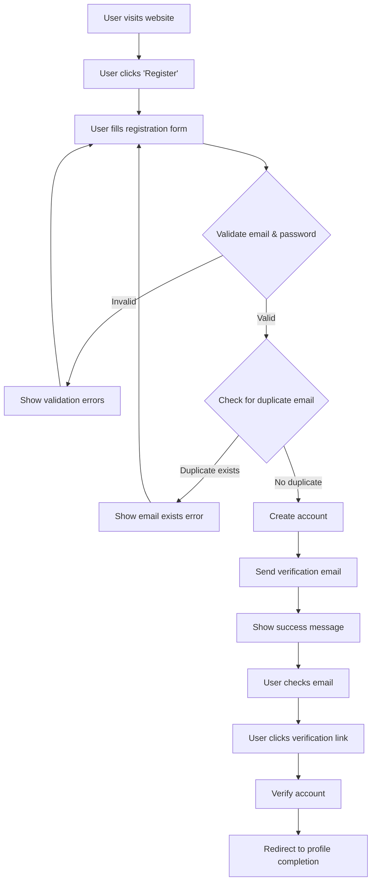

### User Story 1: Email Registration

**Story Points:** 5  
**Priority:** High  
**Dependencies:** None

**As a** prospective student  
**I want to** create an account using my email address  
**So that** I can access the IELTS learning platform

**Acceptance Criteria:**

1. User can access a registration form from the homepage
2. User can enter email, password, and confirm password
3. System validates email format and password strength
4. System checks for duplicate emails
5. User receives a verification email after submitting valid information
6. User can verify their email by clicking the link in the verification email
7. User is redirected to profile completion page after verification

---

**Flow diagram:**

